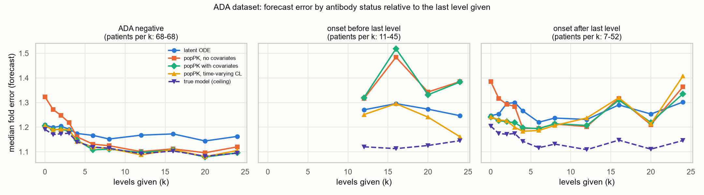
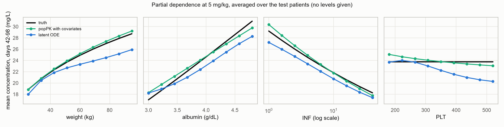
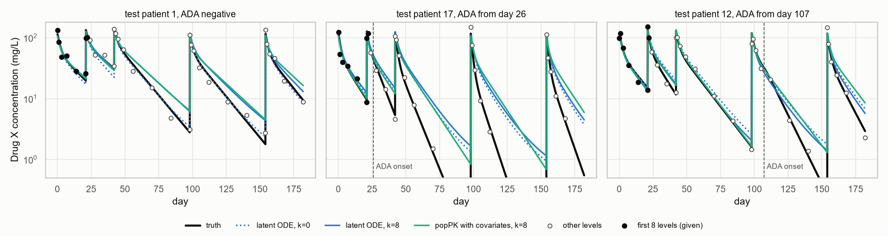

# A latent neural ODE for Drug X pharmacokinetics

[](https://github.com/Wrlog/latent-ode/actions/workflows/tests.yml)

I built this to see how far a latent neural ODE gets at learning a drug's pharmacokinetics from
concentration data alone, when the true model is known and every forecast can be scored against the
exact solution. The network is compared with what a pharmacometrician would normally do: fit a
two-compartment popPK model and forecast each patient by MAP Bayesian estimation from their first few
levels.

Everything here is simulated from a made-up drug ("Drug X") by code in this repo. It's a research and
teaching example only. Nothing in it is validated, and it must not be used for patient care. It follows
the general approach of my PhD work on model-informed precision dosing; the real data and results from
that work aren't public.

The short version: the network learns the population behavior and the covariate effects about as well
as the popPK model, so with no levels its forecasts are as good. Once levels come in, MAP with the popPK
model is clearly better, and on the clean dataset it's close to exact while the network stays 7 to 10%
off. The one place the network does better is the dataset where anti-drug antibodies (ADA) appear
partway through treatment: for patients whose ADA started before the last level it was given, it beats
the constant-clearance popPK model, though not a popPK model with a random walk on clearance.

Median fold error of the forecast after the k-th level, against the exact concentration (120 test
patients per dataset):

| Dataset | k | Latent ODE | popPK, no covariates | popPK with covariates | popPK, time-varying CL | True model (ceiling) |
|---|---:|---:|---:|---:|---:|---:|
| Clean | 0 | 1.169 | 1.304 | 1.171 | | 1.172 |
| Clean | 4 | 1.142 | 1.061 | 1.010 | | 1.000 |
| Clean | 16 | 1.081 | 1.034 | 1.004 | | 1.000 |
| Dose levels + assay error | 0 | 1.193 | 1.311 | 1.188 | | 1.189 |
| Dose levels + assay error | 4 | 1.188 | 1.146 | 1.134 | | 1.134 |
| Dose levels + assay error | 16 | 1.164 | 1.119 | 1.106 | | 1.107 |
| ADA | 0 | 1.223 | 1.341 | 1.219 | 1.219 | 1.197 |
| ADA | 4 | 1.207 | 1.170 | 1.163 | 1.156 | 1.141 |
| ADA | 16 | 1.213 | 1.162 | 1.162 | 1.159 | 1.116 |
| ADA | 24 | 1.188 | 1.165 | 1.146 | 1.127 | 1.107 |


## The simulated data

Drug X follows the shared two-compartment model I use across my demo repos: 2-hour IV infusions dosed
in mg/kg, and

```
CL = 0.30 L/day * (WT/70)^0.75 * (ALB/4)^-1 * (INF/5)^0.10 * 1.8^ADA * exp(eta_CL + kappa_CL)
V1 = 3.2 L * (WT/70) * exp(eta_V1)
Q  = 0.50 L/day * (WT/70)^0.75
V2 = 2.0 L * (WT/70)
```

with 30% IIV on CL, 20% on V1, 15% IOV on CL (one occasion per dosing interval), 15% proportional assay
error and an LLOQ of 0.5 mg/L. Covariates are weight, albumin, an inflammation marker (INF) and platelets
(PLT). INF and albumin come from a shared latent score, so they correlate. PLT has no effect on PK,
which makes it a useful null covariate for the network.

Everyone gets the standard regimen (days 0, 21 and 42, then every 56 days) over 182 days, with dense
sampling: end of infusion, days 1, 3, 7, 14, 28 and 42 after each dose where they fit, a pre-dose level
an hour before each dose, and one at day 182. That's 34 levels per patient.

| Dataset | Dosing | IOV | Assay error and BLQ | ADA |
|---|---|---|---|---|
| Clean | 5 mg/kg | no | no | no |
| Dose levels + assay error | 3, 5, 8 or 12 mg/kg | yes | yes | no |
| ADA | 3, 5, 8 or 12 mg/kg | yes | yes | yes |

Each dataset has 480 patients: 300 for training, 60 for validation, 120 for testing. In the ADA
dataset, the chance of turning positive depends on exposure: a logistic function of the pre-dose level
before the third dose, so it's highest in the 3 mg/kg arm (53% on average) and lowest at 12 mg/kg (29%).
Onset is uniform between days 10 and 120, and clearance then rises smoothly towards 1.8 times its value
with a half-rise of 4 days. 40% of the ADA dataset turned positive. The network and the popPK models
never see ADA status.

Concentrations come from an exact solver: between breakpoints all parameters are constant, so the
two-compartment state is carried forward with the closed-form matrix exponential. The only
approximation is the ADA rise, which is evaluated on 6-hour pieces (within 5e-4 of a tight numerical
ODE solution, which a test checks). Other tests check that the covariates really change CL and the
simulated concentrations in the right direction, that regressing simulated troughs on the covariates
recovers the right signs (and nothing for PLT), and that ADA changes nothing before onset.

## The network

- Covariates go through a small MLP to a context vector c (8 numbers).
- Each patient has a latent vector u (4 numbers), a learned analogue of the random effects. Its prior
  p(u | c) depends on the covariates. An optional causal GRU reads the first k measured levels (log
  level, time, time since the last dose, last dose) and gives the posterior q(u | c, levels). This is the
  network's version of Bayesian updating. With k = 0 the posterior is the prior.
- The dynamic state x (6 numbers) starts at x0(c, u) and follows dx/dt = f(x, u, c).
- Each dose is a jump in latent space at the dose time: x -> x + g(x, u, c, dose).
- A head maps (x, u) to log concentration, so predictions are always positive.
- Predictions use the posterior mean of u, so they're deterministic.

The solver works on a per-patient grid made of the dose times, the query times and filler points so no
gap is longer than 4 days. Each gap is solved in normalized time s in [0, 1] with dx/ds = Δt·f, using a
hand-written fixed-step RK4 (one step per gap), batched over patients. Patients with shorter grids are
padded with zero-length steps, which leave the state unchanged. Time is scaled so one unit is 28 days.
I didn't use torchdiffeq.

## Training

The loss is the Gaussian negative log-likelihood of the observed log levels plus the KL term, both
divided by the number of observed (non-BLQ) samples in the batch. For each patient in each batch, k is
drawn uniformly from 0 to 34, the posterior reads the first k levels, and the loss covers all of that
patient's levels. Other settings: Adam at 3e-3, batches of 50, KL weight warmed up linearly over 25
epochs, gradient norm clipped at 1, learning rate halved after 10 epochs without improvement, and early
stopping after 30 epochs without improvement in validation error (mean squared error on log levels at k
= 0, 2, 6 and 12, from the posterior mean).

Dose-rescaling augmentation: half the patients in each batch get every dose multiplied by a factor
between 0.5 and 2 (log-uniform), and their levels multiplied by the same factor. That's only valid
because Drug X has linear PK. With linear elimination the concentration is a sum of terms each
proportional to its dose, so scaling all doses and all concentrations together gives another valid
patient. With saturable (target-mediated) elimination, doubling the dose more than doubles exposure,
and the augmented patients would teach the network the wrong dose-response. Two smaller caveats apply
here too: the LLOQ censoring isn't rescaled, and in the ADA dataset onset risk depends on exposure, so a
rescaled patient keeps the ADA risk of their original dose.

The three networks train in parallel, one CPU thread each. On my laptop that took about 2 minutes
(135 to 151 epochs before early stopping), and the whole pipeline 165 seconds. A second run gave
identical numbers.

## Comparators and the ceiling

The popPK comparator is a two-compartment model fitted to the training patients by iterative two-stage
estimation: individual MAP fits, then population values, IIV and residual error from those fits, five
times over. Q and V2 are re-estimated by pooled least squares at each iteration. It has IIV on CL and
V1. The covariate version has power effects of WT, ALB, INF and PLT on CL, WT on V1, and fixed allometry
on Q and V2. The no-covariate version has none, so weight only enters through the mg dose. For
forecasting, each test patient's random effects are MAP-estimated from their first k levels. For the ADA
dataset there's a third version with a random walk on log CL from one dosing interval to the next, its
SD estimated by a few more two-stage iterations (0.25 on the log scale). Its forecast carries the last
estimated CL forward.

The ceiling is the true model with the true covariate model, priors and residual error. At k = 0 it
uses the population CL and V1; for k > 0 it fits CL and V1 to the first k levels by MAP. In the ADA
dataset it also knows each patient's onset time. It doesn't know the IOV, which is why it stays above
1.0 in the two noisy datasets. I fit V1 as well as CL because with V1 left at its population value, a
method that learns V1 from the early levels could beat the "ceiling".

Scoring: for each k, the forecast is scored at every sampling time after the patient's k-th level
(BLQ levels are skipped), against the exact concentration, wherever that is at or above the LLOQ.
Median fold error is exp(median |log predicted − log true|). R² is on log concentration, pooled over
patients and times.

## Results

The network matches the covariate popPK model at k = 0 on all three datasets (1.169 vs 1.171, 1.193 vs
1.188, 1.223 vs 1.219) and beats the popPK model without covariates. After that it improves much more
slowly. On the clean data, popPK MAP is within 1% of the truth from four levels on, while the network
gets to about 1.08 and stays there. On the noisy dose-level dataset the gap is smaller but persists
(1.164 vs 1.106 at k = 16), and the popPK model sits on the ceiling. So in this setup the learned
updating from the GRU is clearly weaker than MAP with the right structural model. The settings above
are the best of a handful I tried on these datasets (different widths, latent sizes, RK4 steps and
learning-rate schedules, and starting the posterior narrow); none of them closed the gap. Two options
that didn't help are still in `ModelConfig`: feeding the GRU the prior prediction and the innovation at
each level (`innovations`), and a residual SD that shrinks with k (`sigma_by_k`). In one exploratory run
I also optimized u directly for each patient instead of taking it from the GRU, and the forecasts were
barely better, which points at the decoder more than the encoder.

On the ADA dataset the network's R² is higher than both constant-CL popPK models from k = 6 on (0.927
vs 0.899 at k = 24) even though its median fold error is worse. R² weighs large misses heavily, and the
split below shows where they come from: patients whose clearance went up.

### Forecast error by ADA status



Splitting the ADA test patients by whether onset happened before the last level given:

| Group | k | Patients | Latent ODE | popPK with covariates | popPK, time-varying CL | Ceiling |
|---|---:|---:|---:|---:|---:|---:|
| ADA negative | 16 | 68 | 1.173 | 1.108 | 1.109 | 1.103 |
| ADA negative | 24 | 68 | 1.162 | 1.096 | 1.105 | 1.094 |
| Onset before last level | 16 | 14 | 1.296 | 1.519 | 1.295 | 1.113 |
| Onset before last level | 24 | 45 | 1.247 | 1.384 | 1.161 | 1.145 |
| Onset after last level | 16 | 38 | 1.290 | 1.310 | 1.319 | 1.147 |

Once the levels show clearance going up, the constant-CL popPK model can't follow, and the network does
better than it. The time-varying popPK model does better still once there are enough levels after onset
(1.161 at k = 24). Nobody can forecast an onset that hasn't happened yet; the ceiling is only low there
because it knows the onset time.

### Structural checks

From `results/structural_checks.csv`, on each network's test patients:

| Check | Clean | Dose levels | ADA |
|---|---|---|---|
| Positivity (smallest prediction on a 6-hour grid) | 0.38 mg/L | 0.58 mg/L | 0.57 mg/L |
| Determinism (repeat calls identical, batch size changes < 1e-7) | pass | pass | pass |
| One peak per dose (share of patient-intervals) | 100% | 100% | 100% |
| Dose proportionality (median fold deviation of C(2D)/C(D) from 2) | 1.105, fail | 1.029, pass | 1.040, pass |
| Grid invariance (99th percentile change in log C with a 12-hour grid added) | 0.002 | 0.009 | 0.010 |

The pass mark for dose proportionality is within 5%. The clean network fails it: every patient in that
dataset got 5 mg/kg, and augmentation alone leaves doubled doses about 10% off. The two networks trained
on real dose variety pass. The test for this is marked as an expected failure for the clean network.

Unseen dosing interval: the dose-level network was trained only on 21- and 56-day intervals. On 120 new
patients with maintenance every 35 days, its median fold error was 1.224 at k = 0 and 1.211 at k = 4,
against 1.193 and 1.188 on the training regimen. That's within the 25% margin (on the log scale) I set
for the check.

### Covariate recovery



Each test patient from the dose-level dataset is given each value of one covariate in turn, dosed at 5
mg/kg, and the mean concentration over days 42 to 98 is averaged over patients (with no levels given).
From the lowest to the highest value on each grid, the ratio of mean concentrations was:

| Covariate | Truth | popPK with covariates | Latent ODE |
|---|---:|---:|---:|
| Weight, 25 to 95 kg | 1.53 | 1.55 | 1.44 |
| Albumin, 3.0 to 4.8 g/dL | 1.82 | 1.63 | 1.55 |
| INF, 1 to 40 | 0.63 | 0.59 | 0.64 |
| PLT, 180 to 520 | 1.00 | 0.92 | 0.86 |

The network gets the direction and most of the size of the weight, albumin and INF effects, but it
flattens the weight effect a bit and picks up a spurious PLT effect larger than the popPK model's. With
300 training patients and correlated covariates that's not surprising.



## Running it

Python 3.12. From the repo folder:

```
python -m venv .venv
.venv\Scripts\activate          # or: source .venv/bin/activate
pip install torch --index-url https://download.pytorch.org/whl/cpu
pip install -r requirements.txt
pip install -e .

python scripts/run_all.py       # full run, about 3 minutes here (add --serial to train one at a time)
python scripts/make_figures.py
pytest -q
```

`python scripts/run_all.py --quick` runs everything on tiny datasets for a few epochs and writes to
`results/quick/`. CI runs the tests and the quick pipeline on every push. The tests in
`tests/test_trained.py` use the checkpoints in `models/`, so they check the trained networks as well as
the architecture.

## Layout

```
src/latent_ode_pk/
  pk.py         Drug X model and the exact solver
  simulate.py   virtual patients, the three datasets, sampling schedule
  data.py       event grids and padded batches
  model.py      the latent ODE
  train.py      training loop
  poppk.py      popPK comparators (ITS, MAP, random-walk CL) and the true-model ceiling
  evaluate.py   scoring, structural checks, covariate recovery, ADA split
scripts/        run_all.py, make_figures.py
models/         trained networks from the full run
results/        result tables (CSV/JSON) written by run_all.py
figures/        PNGs drawn from results/
tests/          pytest
```

## Notes

- One seed per dataset and one training seed, so there's no spread on these numbers. Rerunning on the
  same machine reproduces them exactly; other hardware may differ slightly.
- The network is small and trained for about 2 minutes. More training or data might narrow the gap to
  popPK MAP, but nothing I tried in this budget did.
- Dense sampling makes this easier than real TDM, where you'd have a few troughs.
- Not done: a PD endpoint, a learnable allometric dose prior, and a popPK comparator that models ADA
  onset explicitly rather than through a random walk.
