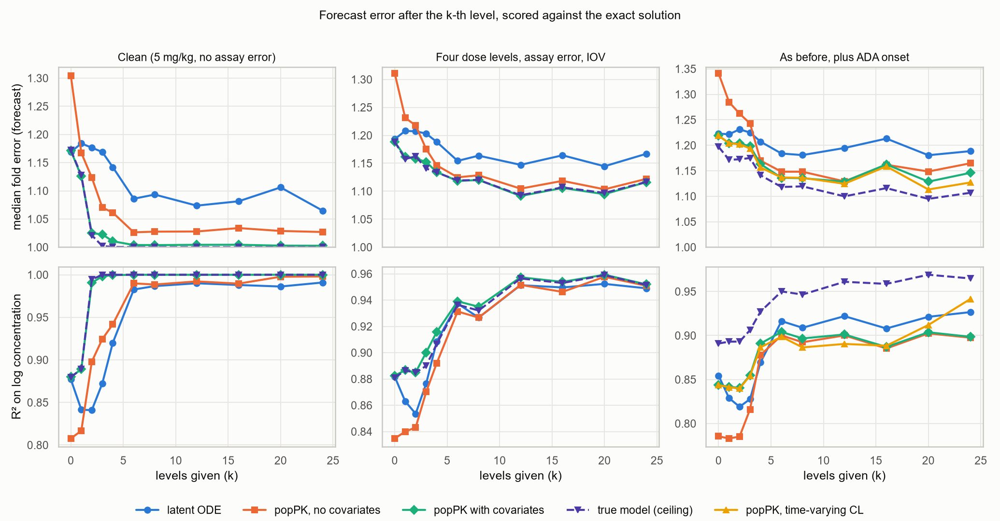

# A latent neural ODE for Drug X pharmacokinetics

[](https://github.com/Wrlog/latent-ode/actions/workflows/tests.yml)
[](https://wrlog.github.io/latent-ode/)

I built this to see how far a latent neural ODE gets at learning a drug's pharmacokinetics from
concentration data alone, when the true model is known and every forecast can be scored against the
exact solution. The network is compared with what a pharmacometrician would normally do: fit a
two-compartment popPK model and forecast each patient by MAP Bayesian estimation from their first few
levels.

Everything here is simulated from a made-up drug ("Drug X") by code in this repo. It's a research and
teaching example only. Nothing in it is validated, and it must not be used for patient care. It follows
the general approach of my PhD work on model-informed precision dosing; the real data and results from
that work aren't public.

Results dashboard: https://wrlog.github.io/latent-ode/ (interactive charts of every result file:
forecast error by dataset, example profiles, the ADA split, covariate recovery, structural checks and
training curves).

## Results in brief

With no levels, the network forecasts about as well as the covariate popPK model and better than popPK
without covariates, so it has learned the population behavior and the covariate effects. Once levels
come in, MAP with the popPK model is clearly better; on clean data it's close to exact while the network
stays 7 to 10% off. The one place the network wins is the ADA dataset, for patients whose onset shows in
their levels: it beats the constant-clearance popPK model there, though not a popPK model with a random
walk on clearance.

Median fold error of the forecast after the k-th level (120 test patients per dataset):

| Dataset | k | Latent ODE | popPK with covariates | True model (ceiling) |
|---|---:|---:|---:|---:|
| Clean | 0 | 1.169 | 1.171 | 1.172 |
| Clean | 16 | 1.081 | 1.004 | 1.000 |
| Dose levels + assay error | 16 | 1.164 | 1.106 | 1.107 |
| ADA, onset before the last level | 24 | 1.247 | 1.384 (time-varying CL: 1.161) | 1.145 |



The full tables, the structural checks (the clean network fails dose proportionality, the other two
pass) and the covariate recovery are on the dashboard.

## The simulated data

Drug X follows the shared two-compartment model I use across my demo repos: 2-hour IV infusions dosed
in mg/kg, and

```
CL = 0.30 L/day * (WT/70)^0.75 * (ALB/4)^-1 * (INF/5)^0.10 * 1.8^ADA * exp(eta_CL + kappa_CL)
V1 = 3.2 L * (WT/70) * exp(eta_V1)
Q  = 0.50 L/day * (WT/70)^0.75
V2 = 2.0 L * (WT/70)
```

with 30% IIV on CL, 20% on V1, 15% IOV on CL (one occasion per dosing interval), 15% proportional assay
error and an LLOQ of 0.5 mg/L. Covariates are weight, albumin, an inflammation marker (INF) and platelets
(PLT). INF and albumin come from a shared latent score, so they correlate. PLT has no effect on PK,
which makes it a useful null covariate for the network.

Everyone gets the standard regimen (days 0, 21 and 42, then every 56 days) over 182 days with dense
sampling, 34 levels per patient. There are three datasets of 480 patients each (300 train, 60
validation, 120 test):

| Dataset | Dosing | IOV | Assay error and BLQ | ADA |
|---|---|---|---|---|
| Clean | 5 mg/kg | no | no | no |
| Dose levels + assay error | 3, 5, 8 or 12 mg/kg | yes | yes | no |
| ADA | 3, 5, 8 or 12 mg/kg | yes | yes | yes |

In the ADA dataset the chance of turning positive is a logistic function of the pre-dose level before
the third dose, so it's highest at 3 mg/kg. Onset is uniform between days 10 and 120, and clearance then
rises smoothly towards 1.8 times its value. 40% turned positive. Neither the network nor the popPK
models see ADA status. Concentrations come from an exact matrix-exponential solver; the ADA rise is
evaluated on 6-hour pieces, which a test checks against a tight numerical ODE solution.

## Methods

The network: covariates go through a small MLP to a context vector c. Each patient has a latent vector u
(a learned analogue of the random effects) with a prior that depends on c, and a GRU reads the first k
levels to give the posterior, which is the network's version of Bayesian updating. A dynamic state x
starts at x0(c, u), follows dx/dt = f(x, u, c), and jumps at each dose. A head maps (x, u) to log
concentration. The solver is a hand-written fixed-step RK4 over a per-patient grid, batched over
patients; I didn't use torchdiffeq.

Training minimizes the Gaussian NLL of the observed log levels plus a warmed-up KL term, with k drawn at
random for each patient in each batch and early stopping on validation error. Half of each batch gets
dose-rescaling augmentation (every dose and every level multiplied by one factor). That's only valid
because Drug X has linear PK; with saturable elimination it would teach the network the wrong
dose-response. The three networks train in parallel in about 2 minutes on a laptop CPU, and the whole
pipeline takes under 3 minutes.

The popPK comparators are two-compartment models fitted by iterative two-stage estimation, with and
without power covariate effects, and each test patient is forecast by MAP from their first k levels. The
ADA dataset gets a third version with a random walk on log CL between dosing intervals. The ceiling is
the true model with the true priors, fitting CL and V1 by MAP (and, for ADA, knowing each onset time).
It doesn't know the IOV, which is why it stays above 1.0 on the noisy datasets.

Scoring: for each k, the forecast is scored at every sampling time after the k-th level against the
exact concentration wherever that's at or above the LLOQ. Median fold error is exp(median |log predicted
− log true|); R² is on log concentration, pooled over patients and times.

## Running it

Python 3.12. From the repo folder:

```
python -m venv .venv
.venv\Scripts\activate          # or: source .venv/bin/activate
pip install torch --index-url https://download.pytorch.org/whl/cpu
pip install -r requirements.txt
pip install -e .

python scripts/run_all.py       # full run, about 3 minutes here (add --serial to train one at a time)
python scripts/make_figures.py
pytest -q
```

`python scripts/run_all.py --quick` runs everything on tiny datasets for a few epochs and writes to
`results/quick/`. CI runs the tests and the quick pipeline on every push. The tests in
`tests/test_trained.py` use the checkpoints in `models/`, so they check the trained networks as well as
the architecture.

The dashboard is built from the committed `results/` files and needs only numpy, pandas and plotly:

```
pip install -r dashboard/requirements.txt
python -m dashboard.build       # writes site/index.html
python -m http.server -d site   # then open http://localhost:8000
```

On every push to main, `.github/workflows/pages.yml` rebuilds it and publishes it to GitHub Pages.

## Layout

```
src/latent_ode_pk/
  pk.py         Drug X model and the exact solver
  simulate.py   virtual patients, the three datasets, sampling schedule
  data.py       event grids and padded batches
  model.py      the latent ODE
  train.py      training loop
  poppk.py      popPK comparators (ITS, MAP, random-walk CL) and the true-model ceiling
  evaluate.py   scoring, structural checks, covariate recovery, ADA split
scripts/        run_all.py, make_figures.py
dashboard/      build.py and the page assets for the results dashboard
models/         trained networks from the full run
results/        result tables (CSV/JSON) written by run_all.py
figures/        PNGs drawn from results/
tests/          pytest
```

## Limitations

- One seed per dataset and one training seed, so there's no spread on these numbers. Rerunning on the
  same machine reproduces them exactly; other hardware may differ slightly.
- The network is small and trained for about 2 minutes. I tried a handful of other settings (widths,
  latent sizes, RK4 steps, learning-rate schedules, a narrow starting posterior) and none closed the gap
  to popPK MAP. Two options that didn't help are still in `ModelConfig` (`innovations`, `sigma_by_k`).
- Dense sampling makes this easier than real TDM, where you'd have a few troughs.
- Not done: a PD endpoint, a learnable allometric dose prior, and a popPK comparator that models ADA
  onset explicitly rather than through a random walk.

## License

MIT, see [LICENSE](LICENSE).
